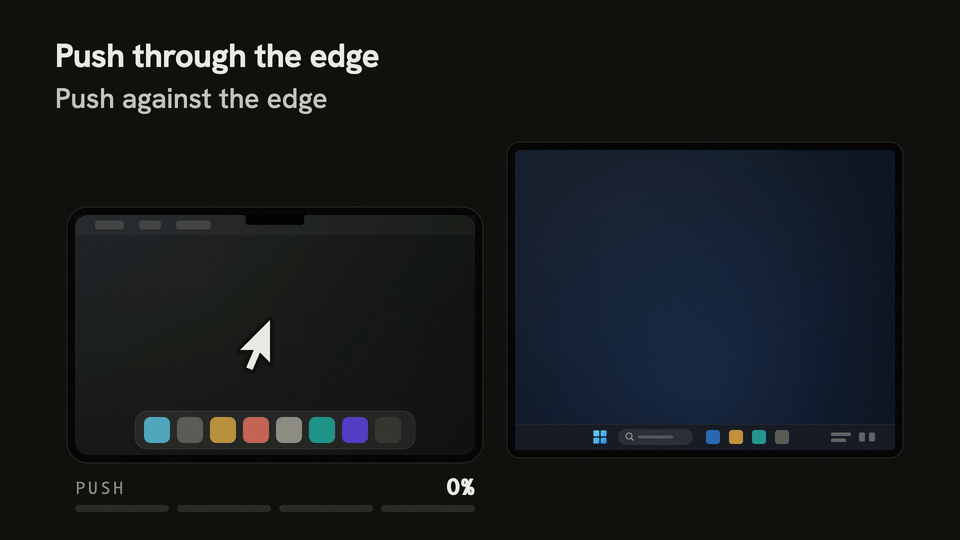
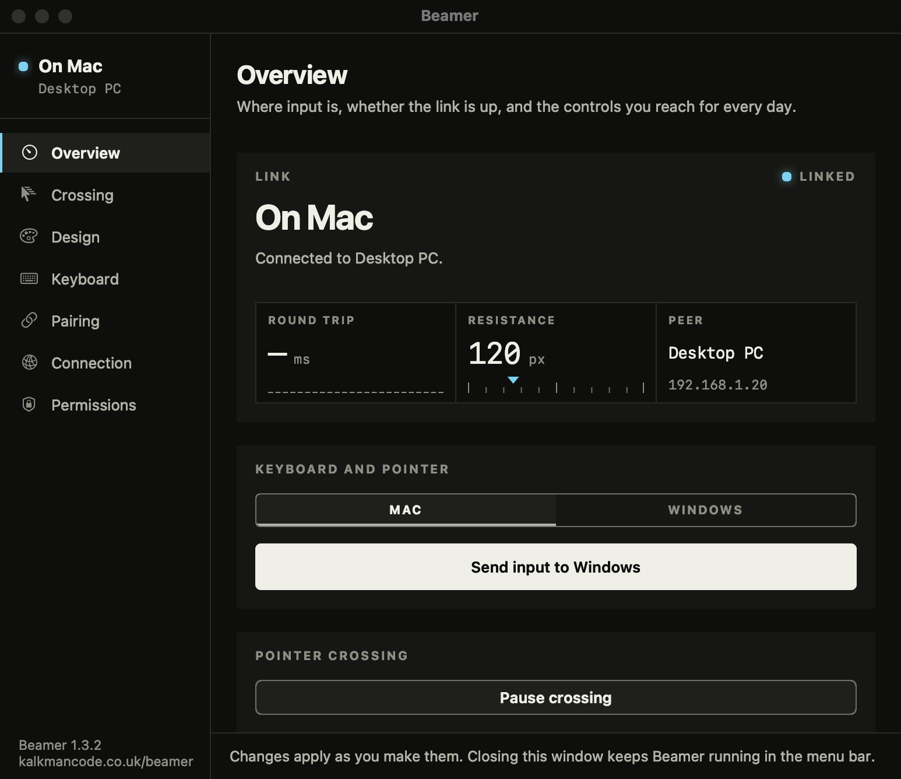
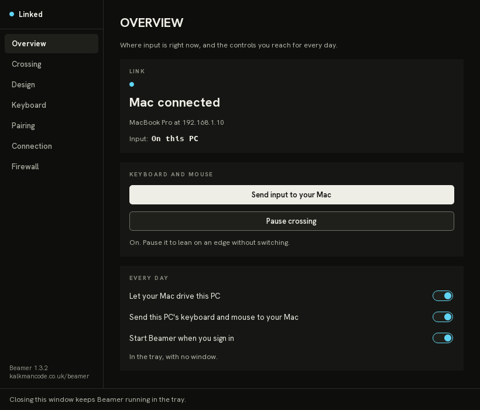
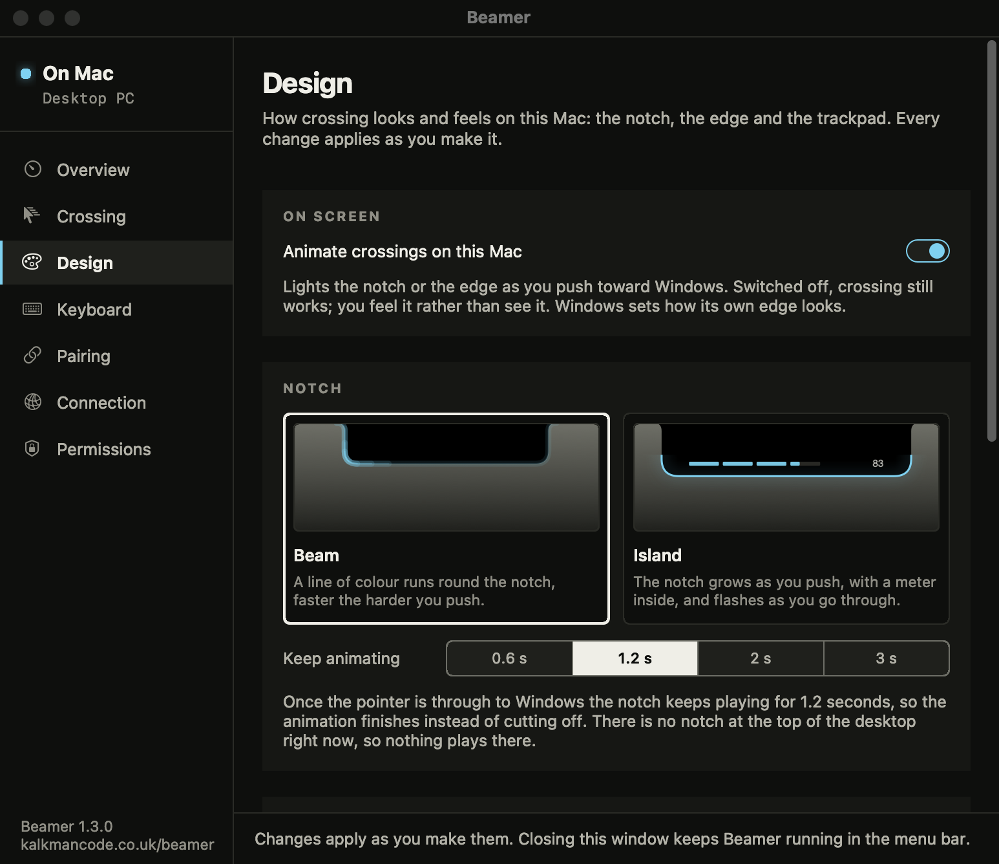
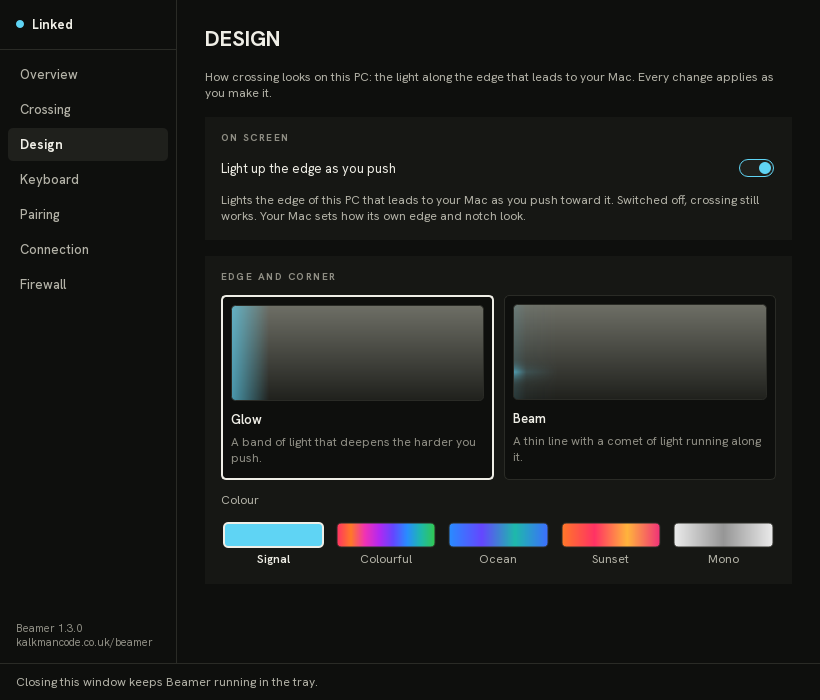

<p align="center"></p>
<h1 align="center">Beamer</h1>
<p align="center">One keyboard and one mouse or trackpad for a Mac and a Windows PC on the same network, in either direction.</p>
<p align="center">
  <a href="https://github.com/kalkman-code/beamer/releases/latest"></a>
  <a href="LICENSE"></a>
  
  <a href="https://github.com/kalkman-code/beamer/releases"></a>
</p>



Push the pointer off the edge of the screen and it carries on onto the other machine, the way it
would onto a second monitor. Or double-tap a key. The clipboard comes with you, your shortcuts
still work, and nothing leaves your network.

## Download

Free, with no account. Every installer is on the [releases page](https://github.com/kalkman-code/beamer/releases/latest).

| Platform | Get it | Notes |
|---|---|---|
| macOS 13 or later | `Beamer-<version>.dmg` | Signed and notarised by Apple |
| Windows 10 and 11 | `Beamer-Setup-<version>.exe` | Not code-signed; see step 1 below |
| Windows, through winget | `winget install KalkmanCode.Beamer` | The same installer, without the warning |

## Quick start

1. **Install on both machines.** On the Mac, drag Beamer to Applications, open it, and press the
   two Grant buttons on the Permissions page (Accessibility, then Input Monitoring). On Windows,
   run the installer. It is not code-signed, because a certificate costs money and Beamer is free,
   so Windows says "Windows protected your PC" the first time: choose More info, then Run anyway.
   winget does not show that warning. Beamer on Windows runs as administrator, so expect one UAC
   prompt when you open it.
2. **Pair them.** On the PC, press Pair a Mac; a six-digit code appears. On the Mac, open the
   Pairing page, choose the PC from the list and type the code. It lasts a minute and works once.
3. **Cross.** Push the Mac's pointer off the right-hand edge of its screen, or double-tap Right
   Option, and the Mac's keyboard and trackpad are on the PC. Push back through the PC's left edge,
   or double-tap again, to come home. The PC's own keyboard and mouse go the other way: push
   through the same edge, or double-tap Right Ctrl.

That is all most people need. The edge, the keys and everything else can be changed in each
machine's settings.

## Screenshots

| Mac | Windows |
|---|---|
|  |  |
|  |  |

## What it does

- **Push through the edge.** Off the edge that faces the other machine, through a corner, or up
  through the MacBook's notch. The pointer arrives at the same point along the border. The edge
  lights up as you push, and the trackpad ticks at every quarter of the way through.
- **Or press a key.** Double-tap or hold a trigger key to switch without moving the pointer. Right
  Option on the Mac and Right Ctrl on the PC to start with; on either machine it can be any key
  that types nothing, recorded by pressing it.
- **Either way round.** The Mac drives the PC and the PC drives the Mac. Each machine has a switch
  per direction, so you can turn one way off and keep the other.
- **The clipboard comes with you.** Text and images, both ways, at the moment you switch. Files
  stay where they are.
- **Your shortcuts still work.** Cmd becomes Ctrl and Option becomes Alt on Windows, so Cmd+C
  copies there too. The PC gets the reverse: its Ctrl+C arrives on the Mac as Cmd+C. Either
  machine can switch to Positional instead, where each key arrives as the key in its place.
- **Media keys follow you.** Play, pause, skip, mute and volume act on whichever machine you are
  driving. Brightness stays with the Mac.
- **Keys and buttons that stay put.** Each machine keeps a list of keys and mouse buttons that keep
  working where they were pressed while its input is on the other one: a mouse's back button for
  this machine's browser, a volume key for its speakers. Add one by pressing it. The back and
  forward side buttons cross in both directions otherwise.
- **Mac gestures on Windows.** Three or four fingers up for Task View, down for the desktop, left
  and right to change virtual desktop, all from the Mac's trackpad.
- **Make it yours.** The edge as a glow or a beam, five colour schemes, the notch as a beam or an
  island with a meter, and how hard you push before it crosses.
- **Out of the way when it should be.** A full-screen app holds the edges, so a game or a film never
  loses the pointer; the trigger key still works. Pause crossing does the same by hand. A drag
  that reaches the edge stays a drag. Switch to a machine that is asleep and Beamer wakes it, where
  that machine answers wake-on-LAN: a PC usually does, a MacBook on Wi-Fi usually does not.
- **Your network, nobody else's.** No server in the middle. The two machines talk to each other
  directly, encrypted, and you pair them once with a six-digit code. More in [SECURITY.md](SECURITY.md).
- **Free and open source.** No account, no subscription, GPL-3.0.

## Settings

Each machine has its own settings window and makes its own choices about how input leaves it.
Both sidebars end with the version and a link to kalkmancode.co.uk/beamer, and both menus have
About Beamer.

| Page | Mac | Windows |
|---|---|---|
| Overview | Where input is, the link and its round trip, Send input and Pause crossing, a switch per direction, start at login | Where input is, the link and its round trip, Send input and Pause crossing, a switch per direction, start at sign-in |
| Crossing | Ways in (edge, corner, notch, shortcut), which edge, never while dragging, resistance | Ways in (edge, corner, shortcut), the arrangement with the Mac, never while dragging, resistance |
| Design | Notch style, edge glow or beam, colour scheme, haptics, with live previews | Glow on or off, Glow or Beam, colour scheme, with live previews |
| Keyboard | Trigger key (recorded), double-tap or hold, what stays on this Mac, modifier style | Trigger key (recorded), double-tap or hold, what stays on this PC, modifier style |
| Pairing | Choose a PC and type its code | Pair a Mac shows the code |
| Connection | The PC's address, port and token | This PC's address, port and token |
| Permissions / Firewall | Accessibility and Input Monitoring | Whether Windows Firewall lets the Mac in, with a one-button fix |

Which edge of the Mac leads to the PC is one setting either machine can change; the two keep it in
step, so the border is always the same one seen from both ends.

## Known limits

- **The Windows secure desktop cannot be driven.** UAC prompts, Ctrl+Alt+Del and the lock screen
  refuse input from any app by design, and Ctrl+Alt+Del cannot be sent at all. Use the PC's own
  keyboard there.
- **Files do not cross**, only text and images, up to 256KB of text and an 8MB image.
- **AltGr is out of reach from the Mac.**
- **The Windows installer is unsigned.** SmartScreen warns until it has a download history; winget
  avoids it.
- **macOS 27 beta 4 could block a signed app's local-network access** even when Terminal could
  reach the PC. The DMG includes `Beamer Tunnel.command` for that case: open it, leave its window
  running, then open Beamer, which uses the tunnel only when its direct connection is blocked.

## In detail

<details>
<summary><strong>Connection states</strong></summary>

Written from the Mac, which connects to the PC. The PC's link to the Mac reports the mirror of
them, naming the Mac.

| Status | Meaning |
|---|---|
| `Connected to <address>:<port>` | The encrypted link is up: the PC decrypted the Mac's first frame, so both hold the same token, and the protocol versions match. Reads `Connected to Windows via secure macOS 27 fallback` when the tunnel is carrying it. |
| `Windows is reachable, but Beamer is not listening on this port.` | The PC answered but nothing accepted the TCP port. |
| `Windows could not be authenticated — check the shared token matches on both sides` | The two derived different keys. The tokens differ. |
| `Windows is unreachable from this Mac` | Nothing got as far as Beamer or the firewall. Check Wi-Fi client isolation, the PC's network, and that the Mac can resolve its address. |
| `Windows did not answer the handshake — it is probably running an older Beamer; update it` | A PC that has never completed a handshake this run is silent, as a Beamer from before encryption is. |
| `Windows receiver speaks Beamer protocol vN, this Mac vM — update both apps` | The wire versions differ. The version travels in cleartext at the start of the connection, so a mismatch says so rather than hanging. |
| `Windows stopped responding` | No ping or acknowledgement for about two seconds. |

Both ends notice a dead link within a few seconds. The PC enforces a 2.5-second read timeout and
the Mac pings at least once a second while idle, so the PC is back to waiting for the Mac within
about three seconds; the Mac notices in about two and takes its input back.

The Mac always fails open. A dropped connection, a missing acknowledgement, a crashed capture
worker or a full event queue returns input to the Mac at once. A watchdog runs for as long as a
socket exists, so a half-open connection is caught and the Mac reconnects even if you never
switched. Trying to switch while the link is down beeps and posts a notification.

</details>

<details>
<summary><strong>Crossing</strong></summary>

Push the pointer at the outer edge and it does not move: the push builds as pressure, the edge
lights up, the trackpad ticks at each quarter, and once you have pushed far enough the boundary
gives. The resistance is the point. An edge that switches the instant you touch it does so every
time you overshoot a close button. The default is 120 points; zero switches on contact.

| Way in | Where it triggers | Mac | PC |
|---|---|---|---|
| Shortcut | Double-tap the trigger key, or hold it | Yes | Yes |
| Edge | The whole of one outer edge of the desktop | Yes | Yes |
| Corner | An 8pt box in one corner, needing a diagonal push | Yes | Yes |
| Notch | The top edge, only within the notch's width | Yes | No |

Any combination can be on. On the Mac, shortcut and the right-hand edge are on to start with.

- The notch has no pixels to light, so a push there draws on the notch itself. Beam, the default,
  runs a comet of light round a small tab under the notch that brightens and speeds up with the
  push. Island springs a black island out of the notch with a four-segment meter; with Reduce
  Motion on it stays one size and fades with the push.
- Only the outer boundary of the whole desktop counts, so an edge between two displays on the same
  machine behaves as the system intends.
- The pointer arrives where it left: 42% of the way down the Mac's right edge is 42% of the way
  down the PC's left edge, on whichever monitor owns it.
- Crossing never fires while a mouse button is held, because a drag that reaches the edge is a drag.
- It suspends itself while a full-screen app has focus. Pause crossing in the Mac's menu bar puts it
  away until you resume it or restart Beamer.
- Only one machine's input is on the other at a time. While the Mac drives the PC, pushing the PC's
  own mouse through the edge sends the Mac's input home and takes the PC's mouse across behind it.
- Either machine's own switch, the menu item or the trigger key, sends the other's input home, so a
  way back never depends on the edge alone.
- Switching to a PC that is asleep sends wake-on-LAN. The PC's hardware address is read from the
  Mac's ARP table after a successful connection, never typed.

Each machine's menu has one tick per direction: This Mac drives Windows and Windows drives this
Mac on the Mac, Mac drives this PC and This PC drives the Mac in the Windows tray. Turning one off
stops that direction only.

</details>

<details>
<summary><strong>Keys, buttons and media keys</strong></summary>

Mac modifiers map to Windows by meaning, so the shortcuts your fingers know keep working. The
Mac's Keyboard page can switch this to positional, where Cmd sends the Windows key.

| Mac key | Sends on Windows |
|---|---|
| Cmd | Ctrl |
| Ctrl | Windows key |
| Option | Alt |

So Cmd+C, Cmd+V, Cmd+Z and Cmd+T are copy, paste, undo and new tab, Ctrl+E opens Explorer and Ctrl
on its own opens Start. The PC's keys arrive on the Mac the reverse way. Chords with Ctrl, Alt or
Windows held are sent as real virtual-key presses, so they land on the right key for the active
Windows keyboard layout. The `key_map` object in each app's config JSON can still override single
keys.

The trigger key is never forwarded. On the Mac it is recorded by pressing it, Right Option to start
with; on the PC it is one of eight modifier and Menu keys, Right Ctrl to start with. Either can
double-tap or hold.

The stays-here list is per machine, because a Mac keycode and a Windows virtual key are different
numbers for the same key. It takes keys, the right, middle, back and forward mouse buttons, and on
the Mac its media keys. A listed press stays on the machine it was pressed on while input is away;
its release goes wherever its press went, so nothing is ever left held down on the far side. The
trigger key cannot be added.

The F7–F12 media row and the volume keys forward as play/pause, next, previous, mute and volume.
On the Mac they arrive as system events rather than key events and are captured separately
(`mac_app/media_keys.py`). Brightness and keyboard-backlight keys stay with macOS, since Windows has
no equivalent.

Ctrl+Alt+Del is the Secure Attention Sequence, trapped by the kernel before any app sees it.
`SendInput` cannot produce it, and `SendSAS()` needs a Windows service or a signed `uiAccess` app
installed under Program Files, which Beamer is not.

</details>

<details>
<summary><strong>Gestures</strong></summary>

Trackpad scrolling is smooth and horizontal scrolling works on Windows. While input is on the PC,
the Mac's system gestures do the equivalent thing there and nothing on the Mac:

| Mac gesture | On Windows |
|---|---|
| Three or four fingers up (Mission Control) | Task View |
| Three or four fingers down (App Exposé) | Show desktop |
| Three or four fingers left or right (Spaces) | Switch virtual desktop, the same way round |
| Thumb and three fingers spread (Show desktop) | Show desktop |
| Thumb and three fingers pinched (Launchpad) | Start |
| Two-finger pinch | Zoom (Ctrl+scroll) |
| Two-finger swipe between pages | Back and forward (Alt+Left/Right) |

The Mac classifies a system gesture when it ends and sends one message. The PC replays it as a real
swipe through a synthetic Precision Touchpad, so Windows' own touchpad settings apply and Task View
animates as it would under fingers. Where Windows refuses that device, it presses the shortcut with
the same default meaning instead (Win+Tab, Win+D, Win+Ctrl+Left/Right, Win). Direction comes from
private macOS event fields, keyed by macOS major version in `mac_app/gestures.py`, because the
horizontal sign has flipped between releases.

</details>

<details>
<summary><strong>Clipboard</strong></summary>

The clipboard moves at the moment of a switch, ahead of the switch itself: switching from the Mac
carries the Mac's clipboard to the PC, and switching back carries the PC's to the Mac. Where it
holds both an image and text, both cross and the pasting app picks. The caps keep the switch
prompt: 256KB of text and an 8MB image as PNG. Over a cap, that half is left alone rather than
truncated. The PC converts to and from the Windows clipboard's DIB format itself, using the Qt it
already ships.

</details>

<details>
<summary><strong>Latency</strong></summary>

If both machines are on Wi-Fi, every event crosses the air twice, Mac to access point to PC.
Ethernet on either machine removes a hop. Where Wi-Fi is unavoidable, 5GHz or 6GHz and turning off
power saving on the PC's adapter both help.

Beamer sends every event at once (TCP_NODELAY). Acknowledgements are coalesced over 15ms so a
100Hz stream of moves cannot double the packet count, with an idle heartbeat every 400ms. The Mac's
settings show the measured round trip while input is on the PC.

</details>

<details>
<summary><strong>Security</strong></summary>

Both apps derive a key from the shared token with HKDF-SHA256 and seal every frame with
ChaCha20-Poly1305. The token is never sent. Pairing agrees a token over X25519, with each side
proving it knows the six-digit code. What that does and does not protect against is in
[SECURITY.md](SECURITY.md).

</details>

<details>
<summary><strong>Windows specifics</strong></summary>

The installer puts Beamer in `%LOCALAPPDATA%\Beamer` for the current user with a Start menu
shortcut. Quit Beamer from the tray before installing a newer version over it; only one instance
runs at a time.

Beamer runs elevated (its exe carries a `requireAdministrator` manifest), because Windows silently
drops input from a non-elevated app aimed at an elevated window such as an admin PowerShell. Start
Beamer when you sign in, on Overview, writes and removes an elevated `Beamer` logon task; nothing
else touches autostart.

Beamer needs two inbound rules on Private networks: TCP 24820 for input and UDP 24821 for pairing,
both below the range Windows and macOS hand out for themselves. The app adds them on its first
elevated start. The Firewall page says in one sentence whether the Mac can get in and offers one
button for whichever of three things usually stops it: the rule is missing (it adds it), Cancel was
pressed on Windows' own "allow this app" prompt, which writes a block rule that beats any allow rule
(it removes the block and adds the rule), or the network is classed as public (it marks the network
private rather than opening the port on every public network).

**The lock screen.** No elevation lets an app type there: it is the Winlogon secure desktop, which
admits only SYSTEM. On a PC with the author's separate unlock credential provider installed (not
part of this repository), switching to a locked PC signals that provider, which unlocks it in about
four seconds; input sent meanwhile is dropped. Beamer only signals the provider and never holds a
password. Without it, the Mac reports `Windows is locked — unlock it at the PC`.

</details>

<details>
<summary><strong>Building from source</strong></summary>

On the Mac, double-click `mac_app/Install-Beamer-Mac.command`. It builds a self-contained app,
installs it at `/Applications/Beamer.app`, and leaves it closed so the permission prompts do not
appear unexpectedly.

On Windows, run `win_app\Install-Beamer.ps1` from an admin PowerShell. It builds and installs
`%LOCALAPPDATA%\Beamer\Beamer.exe`, adds a Start menu shortcut and the two firewall rules. From a
non-admin PowerShell it still installs but skips the rules, which the app adds on its first
elevated start.

Pairing is the easy path, not the only one: each Connection page still takes an address, port and
shared token typed by hand, and they must match on both machines.

</details>

<details>
<summary><strong>Development checks</strong></summary>

From `mac_app`:

```sh
.venv/bin/python3 -m unittest discover -s tests -v
./build_dmg.sh
```

From `win_app`:

```powershell
python -m unittest discover -s tests -v
.\build_win_app.ps1
```

A local Mac build is signed with the release's Developer ID identity when the login keychain can
reach it, so privacy grants carry between local builds and releases, and ad-hoc otherwise (over
SSH), under the hardened runtime either way. It is not notarised.

Files shared by both apps (`receiver.py`, `return_edge.py`, `pairing.py`, `ignored.py`, `tokens.py`
and others) are byte-identical copies, because each app bundles only what sits under it; a test
fails if a pair drifts. `Beamer.svg` is the master of the mark, and `Beamer.ico`, `Beamer.png` and
`Beamer.icns` are rendered from it.

</details>

<details>
<summary><strong>Release builds</strong></summary>

The version lives once, in `VERSION` at the repository root; the Mac build number is the commit
count. Change `VERSION`, commit, then build each platform from that commit. Both commands refuse
uncommitted changes outside `docs/`, upload nothing except the Mac's notary submissions, and write
to `docs/beamer-releases/<version>/` in the folder that contains the repository.

On the Mac, from `mac_app`, in a desktop session (the keychain will not release a Developer ID
identity over SSH):

```sh
./build_dmg.sh --release
```

It signs every nested binary with Developer ID under the hardened runtime with a secure timestamp,
checks the bundle still runs, notarises and staples the app, then the DMG, and checks both with
`stapler validate` and `spctl`. Notarisation uses the App Store Connect API key named in
`~/.appstoreconnect/key_id`.

On Windows, from `win_app`:

```powershell
.\build_win_app.ps1 -Release
```

It runs the tests, builds `Beamer.exe` and compiles `Beamer-Setup.iss` with Inno Setup 6 into
`Beamer-Setup-<version>.exe`. The installer adds no firewall rules and leaves autostart off.

</details>

## Licence and support

GPL-3.0; see [LICENSE](LICENSE). Releases up to and including 1.2.0 were MIT.

Beamer is free and made by one person. Issues are welcome and read, but there is no guarantee of a
reply. Report security problems privately, as [SECURITY.md](SECURITY.md) describes. Home page:
[kalkmancode.co.uk/beamer](https://kalkmancode.co.uk/beamer).
